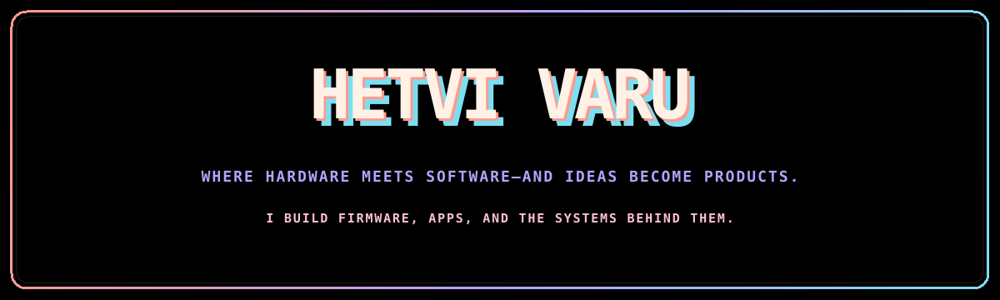

  

  
  

## Hi, I'm Hetvi 👩🏻‍💻

I build where **hardware meets software**—from firmware and connected devices to apps and servers. I love turning an idea on a whiteboard into a complete product you can use, test, debug, and trust in the real world.

- 📡 Working with firmware, ESP32, MQTT, OTA updates, sensors, and device connectivity
- 🖥️ Creating responsive interfaces for real-world hardware
- 🌐 Building apps and server-side systems that bring device data to life
- 🧠 Exploring intelligent edge devices and complete connected products

## My engineering toolkit

## Open source, in the wild

### 🌿 [Airowl — Open Source DIY Air Quality Monitor](https://github.com/airowl-iot/airowl)

I actively contribute to Airowl's embedded firmware, with **40+ public commits** spanning the product's architecture and reliability.

- Developed and refined sensor integrations for environmental monitoring
- Evolved the configuration-driven firmware architecture
- Improved OTA updates and the device UI/SquareLine project
- Added Matter support and resolved watchdog stability issues

→ [Explore my Airowl contributions](https://github.com/airowl-iot/airowl/commits/main/?author=Hetvi3)

I also maintain a public [fork of Espressif's WebRTC solution](https://github.com/Hetvi3/esp-webrtc-solution) while exploring real-time voice and video on embedded devices.

## Things I've built

| Project | What makes it interesting | Tech |
|:--|:--|:--|
| 📲 [Wireless Electronic Notice Board](https://github.com/Hetvi3/Wireless-Electronic-Notice-Board) | A connected display system bridging embedded hardware and communication | `C` `Embedded Systems` |
| 💬 [Client–Server Chat](https://github.com/Hetvi3/Socket-Based-Client-Server-Chat-Application) | A socket-based application exploring real-time network communication | `Sockets` `Networking` |
